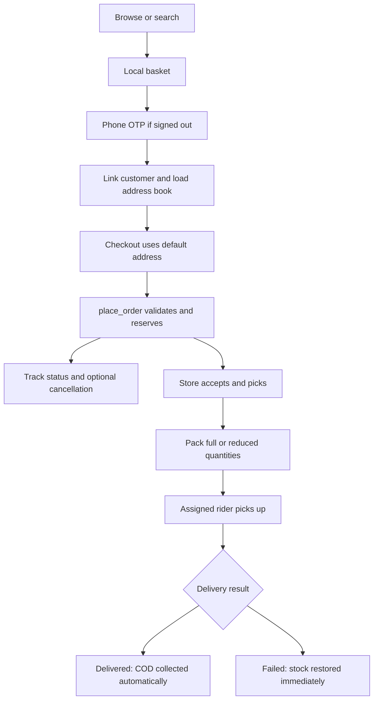
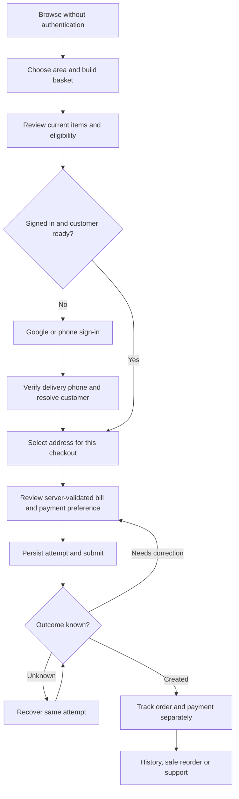
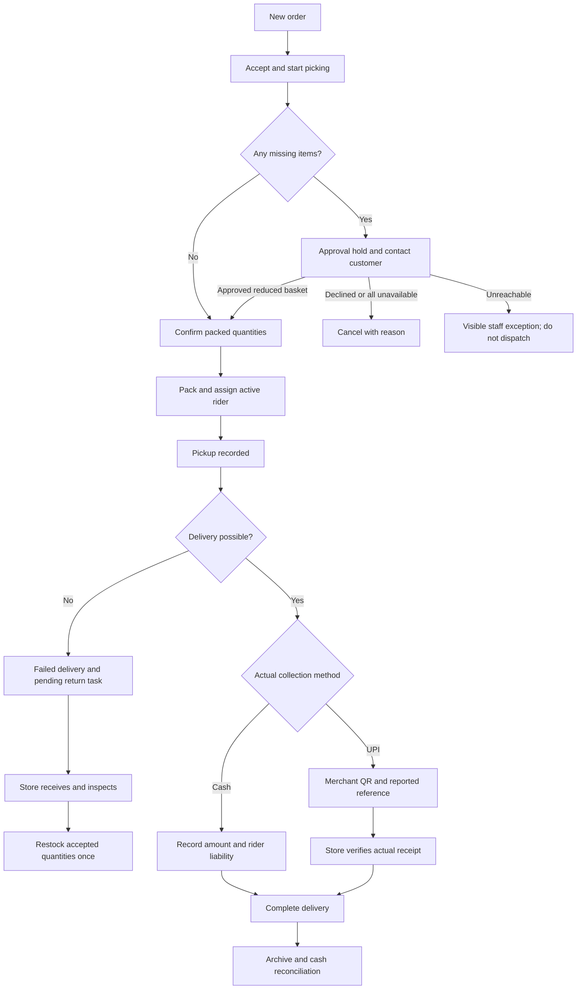

> **Decision, 6 September 2026 (owner + engineering review of PR #3).**
> The findings below were checked against the code and largely confirmed. The
> essential ones shipped the same day as one hardening change (migration
> `0017_hardening.sql` and the matching screens): idempotent placement, address
> and promise snapshots, deleted-address rejection, nothing-packed guard,
> returns received explicitly before restock, collection recorded at the door
> with staff verification of UPI, settlement reopen on late cash, stock
> refusals propagated, per-rider durable queue, checkout address selection,
> cart reconciliation, board polling, order history and store settings screens,
> import row mapping, inventory counts, basket validation and a PR check
> workflow. **Deferred on purpose** for a single store at 30–50 orders a day:
> Google sign-in, the customer-approved shortage workflow, return inspection
> tasks, an immutable cash ledger, per-command revision numbers and the
> six-stage programme. They can be built later on the columns added now. The
> README keeps the 15-minute promise; the text below predates it.

# FAA app-flow audit and redesign specification

- **Status:** proposed implementation specification; documentation-only PR.
- **Reviewed:** 6 September 2026.
- **Audience:** store owner, engineers, reviewers and testers.

This document describes what the app does, where it can fail, what the intended journeys should be, and how to implement the changes without losing orders, money, stock or customer history. It does not implement any of the proposed behavior.

## 1. Scope, evidence and decisions

### Reviewed baselines

- Main: [`1b7237b`](https://github.com/thanush12200/Hospet_delivery_app/tree/1b7237ba6a6679ae70d90305ca09b361ccb5e180).
- UI redesign: [`83a748e`](https://github.com/thanush12200/Hospet_delivery_app/tree/83a748eacd1022170e31b0de357ff201d43b6cda), submitted separately in [PR #2](https://github.com/thanush12200/Hospet_delivery_app/pull/2). Its visual preview is not an authenticated transaction test.
- Customer/admin/rider routes, providers, API wrappers, domain helpers, migrations `0001` through `0014`, test harnesses and deployment configuration were inspected. Source links below are pinned to the reviewed commits.
- The existing local catalogue-media import commit and uncommitted catalogue/Help work are excluded. Reconcile those independently before assigning new migration numbers.
- The deployed database definitions, provider dashboards, branch-protection settings and real operational records were not inspected. A source finding is not a claim that a production incident has occurred.

Evidence labels: **Reproduced** means exercised without live writes; **Static** means directly supported by code; **Risk** means the code permits a failure scenario that still needs an integration test; **Gap** means the selected capability or operational control is absent. P1 blocks a production-readiness sign-off; P2 should be corrected before broad rollout; P3 is subsequent operational improvement. Existing SQL authorization and atomic inventory reservations are valuable safeguards to preserve, not replace with frontend checks.

### Agreed product direction

| Decision | Target |
| --- | --- |
| First deliverable | This audit and implementation plan in a separate documentation PR; no automatic merge. |
| Business | One Hospet store owns inventory, packs orders and dispatches its own riders. |
| Customer authentication | Google alongside phone OTP; a verified delivery phone is required before ordering. |
| Payments | Cash or doorstep UPI paid to the store's merchant account. Staff verify actual UPI receipt. |
| UPI integration | Display a store-issued merchant QR; no gateway or self-hosted payment orchestrator in the launch scope. |
| Missing items | Obtain and record customer approval before packing a reduced order; no silent substitutions. |
| Existing technology | Retain React, MUI, Supabase, server-authorized RPCs and integer-paise arithmetic. |

Defaults used below: retain the configured customer cancellation window and existing legal order lifecycle; do not introduce scheduled delivery, multiple stores, automated refunds, new discount rules or live rider-map tracking. Keep named delivery areas and optional map pins. Pin distance remains advisory, not a new geofencing rule.

**Bottom line:** the database already provides useful authorization and atomic reservation controls, but the complete journey is not ready for a production-readiness sign-off. Prioritize duplicate-order recovery, actual payment collection, inspected returns, durable rider updates, explicit delivery addresses and approved packing before expanding the UI or payment integrations.

### Contents

- [Current journeys](#2-current-journeys)
- [Screen and state coverage](#3-screen-and-state-coverage)
- [Prioritized findings](#4-prioritized-findings)
- [Target flows](#5-target-flows-and-operating-rules)
- [Google and UPI choices](#6-google-and-upi-integration-decisions)
- [Interfaces and change impact](#7-interfaces-and-change-impact)
- [Implementation sequence](#8-implementation-sequence)
- [Verification and release gates](#9-verification-and-release-gates)

## 2. Current journeys

The customer can browse and build a device-persisted basket without signing in. Checkout requires a Supabase session, then reads the linked customer and default address. Placement validates ownership, active zone, inventory and price in SQL, reserves stock, creates a pending payment and returns an order ID. Tracking uses realtime plus polling. History can replace the basket with a reorder.

The store also has manual phone/WhatsApp order entry, product editing/import, stock adjustment, rider records/cash settlement and zone configuration. Its board lists only active orders. Riders see assigned packed/out-for-delivery orders and optimistically update them through a local queue. These surfaces share a transaction lifecycle, but do not yet share complete recovery, collection-verification or exception-handling workflows.

The pending-payment row is bookkeeping, not proof that an online payment provider is connected. Customer, address and role read failures are also not consistently distinguished from missing records.

## 3. Screen and state coverage

Every redesigned screen must distinguish initial loading, successful empty state, failed load, stale data, forbidden access and a pending mutation when applicable. An empty list must never imply a failed request succeeded.

| Surface | Primary job and dependencies | Required recovery and completion behavior |
| --- | --- | --- |
| Home, category, category directory, search | Discover actual catalogue items; use catalogue cache and live availability. | Retry catalogue reads, label unknown stock, preserve filters/search, explain missing/deactivated category and product links. |
| Product sheet and quantity controls | Inspect product, unit, MRP, stock and current basket quantity. | Handle missing images, invalid product links, stock changes, keyboard focus and safe return to browsing. |
| Delivery-area chooser | Set browsing area or current order destination. | Separate temporary selection from saved default; show area-fetch errors and inactive-area guidance. |
| Basket | Edit quantities and review current products, fees and eligibility. | Explain and reconcile changed/deactivated lines; confirm before destructive replacement; retain edits through sign-in. |
| Login and Google callback | Establish identity and preserve the original destination. | Handle consent denial, expired OTP, resend limits, callback failure and incomplete customer setup without redirect loops. |
| Account and phone onboarding | Resolve the linked customer, verified phone and connected identity. | Distinguish incomplete profile from fetch failure; clear old-user state on identity change; explicit conflict recovery. |
| Address list/editor/map | Save usable delivery details and optional pin. | Expose failed reads/saves, preserve drafts, select a newly added checkout address, prevent deleted-address reuse. |
| Checkout | Review selected destination, validated bill and payment preference. | Disable unsafe submission; recover an uncertain attempt before offering another order. |
| Tracking and order history | Show persisted order, immutable destination/promise, changes and collection status. | Last-updated indicator, polling fallback, actionable cancellation result, incomplete-payment visibility and safe reorder. |
| Help | Reach the configured store with order context. | Real contact channels, honest availability and no unsupported service promises. |
| Staff sign-in/navigation | Resolve staff access and enter operations. | Distinguish no role from failed lookup; handle expired session; never grant roles from Google profile metadata. |
| Order board/detail/archive | Accept, pick, approve shortages, assign, dispatch and resolve exceptions. | Poll/focus fallback, live order revision checks, visible action failures, terminal-order search and audited reasons. |
| Manual order entry | Lock a confirmed customer/address, review server-calculated bill, submit once. | Reset identity-dependent state when the phone changes; preserve drafts and surface lookup errors immediately. |
| Catalogue and import | Prepare products, prices, photos and publication state. | Explicit publish/save, stable import row identifiers, row-level failure reporting and rejected-stock propagation. |
| Inventory | Understand physical on-hand, reserved and sellable counts. | Validated integer adjustment, reason, conflict recovery, inactive-product access and movement history. |
| Riders and settlements | Assign provisioned riders and reconcile actual cash. | Account-link status, pending collections, dated reconciliation, audit trail and later-collection reopening. |
| Areas and store settings | Manage active service areas, fees, promises, opening state and contacts. | Preview impact, refresh eligibility at checkout, protect owner-controlled payment destination and retain historical order terms. |
| Rider deliveries | Pickup, call/navigate, collect, deliver or report failure. | Durable per-rider pending actions, ordered retries, explicit conflicts and return-to-store tasks. |
| PWA/preview/deployment | Run on installed mobile browsers and upgrade safely. | Separate sample/live data, protect drafts/queues during updates and enforce checks before merging. |

## 4. Prioritized findings

### F01 - P1 - Retrying uncertain placement can create another order

**Evidence: Static; lost-response scenario requires integration testing.** [Checkout][s-checkout] sends an ordinary request and retains the basket after transport failure. [place_order][s-place] has no caller-scoped attempt identifier or replay lookup, and inserts a new order/payment on each successful invocation. The same exposure exists in staff manual entry.

**Trigger and impact:** the server commits, the response is lost, and the customer retries. Stock is reserved twice and staff may dispatch duplicate orders. A disabled button only protects one render's interaction, not reloads or retries.

**Correction / acceptance:** persist an attempt before sending; atomically deduplicate server-side and recover the same result. Concurrent identical retries produce one order, reservation, payment record and initial event. Changed payload with the same key is rejected, not silently substituted. Depends on delivery/bill snapshots in F06/F07.

### F02 - P1 - UPI collection has no verified completion path

**Evidence: Static.** The [money transition][s-money] marks only COD paid. The [rider UI][s-rider-ui] lets UPI orders move to delivered without a receipt-verification step. For COD paid by UPI instead, its instruction is to tell the office at settlement, while the database records cash.

**Trigger and impact:** an order is delivered but its UPI payment remains pending indefinitely, or the rider owes cash that the store actually received digitally. The checkout preference is being used as collection evidence.

**Correction / acceptance:** capture actual method and amount, separate reported from verified UPI, and provide a staff verification queue. No client callback, entered reference or screenshot marks paid. Cash-to-UPI switches must never inflate rider cash. Duplicate receipt verification cannot credit two orders. Depends on F12 and the selected merchant-QR process.

### F03 - P1 - Failed deliveries replenish sellable stock before inspection

**Evidence: Static.** [FAILED handling][s-failed] immediately adds fulfilled quantities to `on_hand`; the rider dialog promises automatic stock restoration. This does not distinguish returned, damaged, missing or still-in-transit goods.

**Trigger and impact:** a rider reports failure while still carrying the goods, or the goods are damaged. Another customer can buy stock that is not available at the store.

**Correction / acceptance:** mark delivery failed and open a return task without increasing sellable stock. Staff reconcile expected versus received quantities, inspect condition and restock only accepted units once. Retain the failed order as history; a retry sale is a new confirmed order. Cover partial returns and replayed receipt commands.

### F04 - P1 - Rider queue can silently lose actions

**Evidence: Reproduced with in-memory storage and simulated responses.** [Queue writes][s-queue] swallow storage errors, and `drain()` continues after transport failure and removes every `ok:false` result. [The rider screen][s-rider-actions] changes visible state before enqueueing, can invoke overlapping drains, and uses one device queue for all riders.

**Trigger and impact:** storage fails but the screen implies delivery was saved; or pickup fails to sync, delivery is attempted against `PACKED`, and delivery is discarded. A different rider/session can also submit another rider's pending commands and receive rejections. Polling can overwrite optimistic state with an older server snapshot.

**Correction / acceptance:** validate storage, persist before optimistic success, isolate by auth/rider identity, serialize processing, and stop dependent commands when their predecessor is unresolved. Show queued/conflicted state per order. Keep recoverable failures, reconcile already-applied actions, and never silently drain another rider's queue. Sign-out must disclose pending work. Depends on idempotent server commands and expected order revision.

### F05 - P1 - Adding a checkout address may leave the previous destination selected

**Evidence: Static.** [Address creation][s-address-edit] defaults `isDefault` to false when addresses exist, discards the returned address ID, and returns to checkout. [Checkout][s-checkout] reads `defaultAddress` rather than an explicit checkout selection.

**Trigger and impact:** a returning customer adds a new destination during checkout but the old default is still used. The summary exposes it, but the workflow makes misdelivery likely.

**Correction / acceptance:** keep `selectedCheckoutAddressId` separate from the address-book default. Adding from checkout selects the saved ID immediately; making it default is independent. Editing/deleting/invalidating that address forces revalidation before ordering, with no silent fallback to another address.

### F06 - P1 - Address edits and zone changes can rewrite order presentation

**Evidence: Static.** [Address upsert][s-address-sql] edits the existing row. Customer/admin/rider API reads join that row; tracking also reads today's zone SLA. [Order creation][s-place] stores foreign keys but no original address or delivery-promise snapshot.

**Trigger and impact:** editing a saved address can change what the rider sees for a live order and what a past order displays, while its stored zone and fee still describe the original destination. Editing SLA or disabling a zone can also change or hide the historical promise returned by the join.

**Correction / acceptance:** snapshot address text, zone identity/name, coordinates, contact details needed for fulfilment and promised delivery timestamp on placement. Address-book and zone changes affect new quotes only. Do not claim a backfilled current address or SLA was the historical original. Test changes while picking and after delivery.

### F07 - P1 - Price mismatch has no complete recovery path

**Evidence: Static.** [Basket state][s-cart] persists complete product snapshots and retains the old product when adding an existing line. [Catalogue loading][s-catalogue-api] and [checkout][s-checkout] do not reconcile those snapshots after `PRICE_MISMATCH`; the error tells the customer to review the cart.

**Trigger and impact:** changing MRP or delivery fees makes repeated placement fail even after navigating back to the basket. A deactivated product can remain in a saved basket with no directly actionable reconciliation.

**Correction / acceptance:** obtain current canonical lines and eligibility, explain changes and let the customer accept the revised bill or remove affected items. Keep quantity choices; do not silently replace products or accept a changed price. Both shopper and manual order entry use the same non-reserving server quote. Test refresh, restored carts and changes between quote and placement.

### F08 - P1 - Product/import success can hide a refused stock update

**Evidence: Static.** [Product upsert][s-product-upsert] and [bulk import][s-import-sql] use `perform admin_adjust_stock(...)` and ignore its JSON result. [The stock RPC][s-adjust-stock] returns `ok:false` when the requested count is below reserved stock, without throwing.

**Trigger and impact:** staff see a successful product/import update even though the requested physical count did not change. Partial product changes can make the reported operation disagree with the stored result.

**Correction / acceptance:** validate/lock before mutation and propagate stock refusal. A product-and-stock edit is all-or-nothing; an import reports each row's complete outcome. Preserve existing per-row import semantics without hiding failures. Verify a below-reserved edit leaves both product fields and stock unchanged for that row.

### F09 - P1 - Packing bypasses the selected shortage-approval policy

**Evidence: Static policy gap.** [Order detail][s-order-detail] submits reduced fulfilled quantities without approval evidence, and [board quick actions][s-board] can pack without reviewing quantities. SQL defaults unspecified fulfilment to the ordered quantities. It also permits all quantities to be zero, leaving the original delivery fee.

**Trigger and impact:** unwanted partial orders, misleading full-pick confirmations, or a delivery charge on an empty order.

**Correction / acceptance:** require explicit quantity review and server-enforced approval for a changed basket. Cancel all-unavailable orders with no delivery charge. A stale board or old client cannot bypass the approval gate. No fee increase or renewed minimum-order requirement caused solely by store shortages.

### F10 - P2 - Authentication success is conflated with customer readiness

**Evidence: Static plus race risk.** [Login][s-login] redirects any existing session once `busy` becomes false, including after customer linking fails. [Customer loading][s-customer-state] catches profile/address errors and ends in `ready`; [role resolution][s-auth] has no request-generation check to discard older identity lookups.

**Trigger and impact:** a valid session reaches checkout with no usable customer, address-fetch failure looks like an empty address book, or a late response restores prior-user UI state after sign-out/account switching. Database RLS remains a separate safeguard; this is not evidence of an authorization bypass.

**Correction / acceptance:** model resolving, anonymous, needs-phone, needs-customer-link, ready and error states explicitly, with independently retryable addresses/roles. Clear identity-dependent data immediately, scope results to the current UID, and keep linking failures on a recoverable onboarding screen. Inject delayed responses and switch users in tests.

### F11 - P2 - Manual orders can retain a previously selected customer

**Evidence: Static.** [Manual entry][s-new-order] leaves `customerId` and addresses unchanged when the editable phone changes. Its lookup error is rendered inside a later section that is absent before a customer exists. Customer lookup also uses the entered phone string without the shared normalization used by phone login.

**Trigger and impact:** staff edit the visible number but submit to the old customer's address, cannot see an initial lookup failure, or create separate records for differently formatted numbers.

**Correction / acceptance:** normalize and validate phone numbers, explicitly confirm the matched customer, and reset dependent address/quote state when identity input changes. Show all lookup errors at the step that failed. Preserve basket items as a draft, but prevent submission until the new customer/address is confirmed.

### F12 - P1 - Settlement totals can change while still labelled settled

**Evidence: Static.** [COD delivery][s-money] increments an existing settlement's expected cash without reopening its status. [Settlement][s-settle] overwrites deposited cash and marks every mismatch `SHORT`, including overpayment. UI/API dates use UTC ISO dates; database collection uses `current_date` with no explicit Hospet business timezone.

**Trigger and impact:** a delivery after reconciliation changes the expected balance while the row stays `SETTLED`. Different date interpretations around midnight obscure which shift owes the cash; repeat deposits overwrite evidence rather than preserving handovers.

**Correction / acceptance:** derive the business date server-side in `Asia/Kolkata`; record immutable collections and handovers; expose outstanding/short/over balances; reopen when later collections change the balance. Validate nonnegative integer amounts and audit corrections. Do not silently rebucket historical rows without evidence. Test before/after local midnight and settlement followed by another delivery.

### F13 - P2 - Deleted addresses remain eligible on some paths

**Evidence: Static.** [Staff address listing][s-admin-api] does not filter `deleted_at`; [place_order][s-place] verifies ownership and active zone but not soft deletion, which was introduced later.

**Trigger and impact:** a stale client or manual order can place an order against an address the customer removed. Historical address access is legitimate; new-order eligibility is not the same thing.

**Correction / acceptance:** filter selectors and reject deleted addresses server-side while retaining historical snapshots. Revalidate address revision at commit to cover concurrent edit/delete. A previously valid address ID must fail after deletion without creating/reserving anything.

### F14 - P2 - Reorder silently replaces an existing basket

**Evidence: Static.** [Order history][s-orders-page] calls `cart.replace()` directly.

**Trigger and impact:** a customer browsing past orders loses the basket they were building after one tap.

**Correction / acceptance:** build a current-price reorder preview; require explicit replace confirmation when a basket exists, otherwise add it directly. Cancel leaves the original basket untouched. Continue using ordered quantities, while clearly identifying unavailable or repriced lines.

### F15 - P2 - Operational read failures are sometimes invisible or misleading

**Evidence: Static.** [Order detail][s-order-detail] renders only a spinner when its first read fails; the error is below the `!order` return. Customer address/zone errors are swallowed. Rider role lookup failure can fall into the not-registered screen. Several admin auxiliary queries ignore returned errors.

**Trigger and impact:** a missing order, bad connection or expired permission can look like endless loading, no addresses, no cash or missing staff setup.

**Correction / acceptance:** use explicit loading/error/empty/stale/forbidden states and bounded retryable requests. Preserve known data with last-updated labels; keep failed saves and editable drafts visible together. Test every matrix row with a failed first request and a failed subsequent refresh.

### F16 - P2 - Realtime alone is insufficient for the staff board

**Evidence: Static.** [The board][s-board] subscribes and refreshes initially, but has no polling/focus fallback or subscription-health indicator. Detail does not subscribe to changes. Customer tracking and rider lists already provide useful fallback patterns.

**Trigger and impact:** a lost channel leaves staff acting on stale status, and one failed action's message can be cleared immediately by a successful refresh. Concurrent requests can resolve out of order.

**Correction / acceptance:** refetch on focus/reconnect and every 30 seconds while visible; debounce realtime bursts and discard stale responses. Keep action failures separate from read status. Validate expected order revision server-side and display the refreshed conflict instead of implying the command succeeded.

### F17 - P2 - Terminal orders and store configuration lack operational surfaces

**Evidence: Gap.** [Routes][s-routes] expose only the active order board, despite a recent-orders API. There is no store-settings screen for open/closed state, contact channels or cancellation window. Rider account provisioning still requires dashboard/manual auth linkage.

**Trigger and impact:** delivered/failed orders disappear from the normal board before payment/return issues are resolved, and store staff cannot complete routine setup within the app.

**Correction / acceptance:** add an all-orders archive and exception views for unpaid deliveries, pending returns and approval holds. Add owner-controlled store/payment settings and show rider provisioning status. Keep secure Auth user provisioning in a documented owner-only dashboard process initially; do not ship service credentials in the browser.

### F18 - P2 - Choosing a photo can publish a new product before Save

**Evidence: Static.** [Product photo selection][s-catalogue-ui] creates a product to obtain an ID before uploading; the draft defaults to active. Cancelling the form does not undo that creation. Cancel/replacement can also leave unreferenced uploads.

**Trigger and impact:** incomplete products become visible or stock is created despite cancellation; abandoned media accumulates. Upload completion can arrive after the draft has changed.

**Correction / acceptance:** keep new products hidden drafts until explicit publish, bind uploads to a stable draft ID, and distinguish saved metadata from pending upload. Report failed attachment accurately and provide cleanup of abandoned assets. Cancel/upload-failure tests must not publish a product or alter sellable stock.

### F19 - P2 - Import error rows can point to the wrong source row

**Evidence: Static.** [Import UI][s-import-ui] submits only `valid` rows, then displays the server's compacted row indices as original rows. Invalid stock parses to null and is not treated separately from an intentionally blank stock cell; fractional stock is rounded instead of rejected. F08 also applies.

**Trigger and impact:** staff fix the wrong spreadsheet row or believe an invalid stock cell was applied. Matching by normalized name and pack is convenient but ambiguous if the catalogue already contains duplicates.

**Correction / acceptance:** retain original source row IDs, validate stock separately from blank, preview the exact matched product or flag ambiguity, and return a downloadable result report. A test with an invalid row before a failed valid row must identify the original row correctly. Preserve planned media-import columns when reconciling the separate import branch.

### F20 - P2 - Inventory UI does not explain the quantity it edits

**Evidence: Static.** [Inventory][s-inventory] displays available quantity but edits absolute on-hand quantity, omits reserved/on-hand columns, and uses the shopper's active-only catalogue. Adjustment reasons are effectively fixed by the UI.

**Trigger and impact:** staff may enter the sellable count as physical stock or cannot reconcile a hidden product. Repeated clicks and stale absolute counts can overwrite a concurrent operator's intent.

**Correction / acceptance:** show on-hand, reserved and available separately; include inactive products in staff views; require reason and expected inventory revision. Keep absolute stocktake separate from received-stock additions. Never permit lowering on-hand below reservations. Test concurrent adjustment, stock receiving and reservation changes.

### F21 - P2 - Cached or unknown information can look authoritative

**Evidence: Static/risk.** [Catalogue loading][s-catalogue-api] can fall back to stale cache without freshness metadata exposed to the screen; it also waits for the version check before returning cached data. Availability read failures preserve previous values. Store/zone settings load once per provider mount.

**Trigger and impact:** slow/offline browsing is not as immediate as the comments promise; old prices, open-state or stock are presented without an age. SQL still validates placement, but the customer discovers discrepancies late.

**Correction / acceptance:** render valid cached catalogue promptly, refresh in the background and expose stale/error age. Represent stock as unknown until verified, and refresh settings/availability at checkout and on reconnect/focus. Browsing may continue offline; authoritative order submission may not proceed without online validation.

### F22 - P2 - Persistent basket data is trusted without validation

**Evidence: Static.** [Cart initialization][s-cart] casts parsed JSON directly to `CartLine[]`. Valid JSON with the wrong shape can break reducers or arithmetic. Writes swallow storage failures; there is no cross-tab storage reconciliation.

**Trigger and impact:** old client formats, corrupted storage or concurrent tabs can crash the app or restore surprising quantities. The generic crash screen may promise the cart is safe when persistence actually failed.

**Correction / acceptance:** version and validate stored baskets, retain only valid positive integer lines, report memory-only operation, and reconcile cross-tab changes explicitly. Keep the existing device basket across sign-out, but clear identity/address/quote state. Test malformed JSON, valid wrong-shaped JSON, storage denial and two tabs.

### F23 - P2 - Release checks do not establish transaction readiness

**Evidence: Static.** [Deployment][s-ci] checks on pushes to main, not pull requests, and omits SQL, authenticated browser and bundle-budget checks. The current browser verifier exercises sample shopping and signed-out role entry, not end-to-end role actions. [Database reset][s-db-reset] is destructive and [the oversell script][s-oversell] includes a remote/live mode.

**Trigger and impact:** green unit tests or a successful visual preview can be mistaken for safe payment/fulfilment behavior, and an incorrectly targeted test command can mutate the wrong database.

**Correction / acceptance:** add a PR validation workflow with isolated fixtures, explicit test-database safeguards and role-specific tests. Require the budget check. Deployment should consume already-validated changes; branch protection must be configured and verified separately. Do not run the existing reset or remote oversell commands on production.

### F24 - P2 - Installed clients and changed contracts need an upgrade strategy

**Evidence: Risk.** [PWA configuration][s-pwa] enables automatic updates; order, payment and queue contracts are consumed by installed clients. Some previous migrations dropped old RPC overloads. New return/payment rules cannot rely on users immediately refreshing.

**Trigger and impact:** an old app may invoke old unsafe mutations, fail on new responses or reload during a draft/unsynced action.

**Correction / acceptance:** use additive schemas, compatibility wrappers and server-enforced guards. Gate incompatible writes with an upgrade-required result, preserve local drafts/queues, and prompt for an update at a safe point. Test old client against new backend and pending rider work across an update. Frontend rollback must not restore unsafe server behavior.

## 5. Target flows and operating rules

### Customer journey

1. Show the actual store/catalogue first. Ask for an area without requiring location permission. Keep anonymous browsing and device basket behavior.
2. At checkout entry, refresh canonical products, availability, active area and store status. Show specific changed lines and a revised total before acceptance. A quote does not reserve stock.
3. Resolve identity before protected actions. Preserve basket and a same-origin, customer-route return destination through OAuth/OTP. Do not send a staff-only account into a disabled customer checkout without explanation.
4. Use an explicit address selection, initially the valid default. Saving from checkout selects the returned address ID even when it is not made default. Revalidate after address edits; never change the destination silently.
5. Confirm the full bill and payment-at-door preference. Keep note/payment/address drafts on navigation or network failure. Unknown store/zone state blocks placement with Retry, not a false zero fee.
6. Save the attempt ID and immutable intended payload before the first request. While its outcome is unknown, recover it before changing or replacing that attempt. Only clear purchased lines after confirmed success; preserve lines added in another tab after submission began.
7. Tracking shows the persisted promise, latest successful update, packed changes, delivery state and payment state independently. Retain polling fallback. An old promise becomes delayed, not silently extended by editing the zone SLA.
8. Retain the configured self-cancellation window for `PLACED`/`CONFIRMED`. Server eligibility is authoritative. After picking begins, contact the store; staff cancellation requires a reason. Reorder shows unavailable/repriced items and confirms before replacing an existing basket.

### Store, rider, payment and return journey

- **Acceptance/picking:** board shortcuts open quantity review before packing. All commands carry the last observed order revision. The server refuses invalid transitions, inactive/unassigned riders, unresolved approval holds or stale fulfilment.
- **Shortage approval:** staff record the revised quantities and bill plus who approved, contact channel and time. Reductions only; substitutions are out of scope. Unreachable customers stay on a visible hold until staff resolves or cancels with a reason. No automatic dispatch or silent timeout cancellation. Keep the original delivery fee for an approved shortage; do not reapply the minimum. All-unavailable means cancel and zero payable delivery fee.
- **Dispatch:** only packed orders appear as ready for pickup. Early assignment may be recorded, but must not claim the rider can pick up while packing. Reassignment invalidates the former rider's pending authority and creates an explicit conflict for reconciliation.
- **Cash:** confirm the actual collected amount against the final bill. Record collector, time and business date atomically with delivery. No partial cash payment in the normal completion path; mismatches require a staff exception.
- **UPI:** customer pays the displayed store merchant account. Rider records reference and amount; staff checks actual incoming credit. Keep payment pending until verified. Normal handover waits for verification; only an audited staff override can record physical delivery before receipt is verified. Such orders remain in the unpaid-delivery queue and are never relabelled paid by that override.
- **Exceptions:** order and payment are independent facts. If goods have already been handed over, record the physical event with a staff-authorized exception rather than falsifying payment status. Failures, disputes, wrong amounts and duplicate transfers remain visible until resolved. Manual refunds require recorded evidence and owner approval; automatic refunds are deferred.
- **Returns:** a failure creates an expected-return record, not an inventory increase. Staff records received-good, damaged and missing quantities. Only good quantities enter sellable stock, once. Packed cancellations at the store also require actual receipt/unpacking confirmation before reuse.
- **Cash handover:** track cumulative cash collections and separate deposit events, with actor/time/reason. Owner confirms reconciliation, including overage/shortage. Later collections reopen the balance. UPI to the store never becomes rider cash liability.

### Common UI and state rules

- Use the existing visual system and components; prioritize dense, scannable operations lists and ergonomic mobile delivery actions over another cosmetic overhaul.
- Preserve entered values after failure. Put mutation errors beside the affected form or command; successful background reads must not erase them. Retry controls retry only the failed read or known idempotent command.
- Give every page a bounded loading state and a separate no-data state. Preserve usable stale data with last-updated indicators. Do not show stock, fees, contact details or role lookup as successfully empty after a failed query.
- Use native links/buttons, labelled inputs, visible focus, modal focus restoration and mobile-safe fixed actions. Verify long product/address/Kannada names, keyboard use, text zoom and 320px widths. Do not encode payment/stock state using color alone.
- Add archive and exception navigation, store settings, rider provisioning status, inventory history and import reports. Preserve existing route deep links; unavailable records receive an explanation and a useful return destination.
- OWNER controls merchant payment destination, provider setup, staff access, reconciliation and financial corrections. STAFF handles orders, catalogue, inventory, UPI receipt checks and return inspection. Assigned active riders act only on their orders. Enforce this target matrix in SQL as well as UI; the existing `is_admin()` helper does not distinguish these permissions.

## 6. Google and UPI integration decisions

### Google: optional sign-in, not a replacement for delivery-phone verification

Use the existing Supabase Google OAuth provider; do not introduce a second auth service. Basic `openid`, `email` and `profile` scope is sufficient. Name/email and optional picture support account presentation; Google sign-in is not consent to marketing or access to contacts, Gmail or Drive. Standard identity claims do not provide a verified delivery phone. [Google identity documentation][google-oidc].

Configure the Google OAuth client, consent screen and Supabase provider outside the frontend. Put the client secret only in provider/server configuration, never in a `VITE_` variable. Allowlist exact local and production callback destinations, provide public privacy/terms pages before enabling production OAuth, and follow Google's sign-in branding. Handle callback denial/error, reload and safe return routing. Provider readiness is a rollout prerequisite, not something this docs PR establishes. [Supabase Google setup][google-setup].

For a new Google user, add/verify the phone on the same authenticated Supabase user, refresh the verified session, then invoke the customer-linking path. Use the supported phone-update OTP flow, not a second `signInWithOtp` that unexpectedly switches users. Never accept a client-entered phone as verified. [Phone update flow][phone-docs].

For an existing phone customer, offer explicit Google linking while signed in, preserving the same auth UID/customer/orders. If Google-first onboarding discovers a number already tied to another account, stop automatic linking and offer phone sign-in to recover the original account. If two distinct auth identities already exist, do not silently delete/merge either: retain the existing account and use an owner-supported, separately verified resolution. Automatic arbitrary-account merging is out of scope. Supabase's email-based linking does not solve every phone-only account conflict. [Identity linking][identity-docs].

**Cost, checked 6 September 2026:** Supabase includes social OAuth and 50,000 monthly active users on Free; Pro currently starts at USD 25/month and includes 100,000 MAUs. Adding Google alone does not require an upgrade within existing limits. SMS delivery is separately priced by the configured provider. These are published plan terms, not a forecast or a promise that hosting/SMS remain free. Recheck before procurement. [Supabase pricing][supabase-pricing].

### UPI: store merchant QR and manual verification for launch

Use a store-issued merchant QR from the store's bank/payment app, display the payee identity plus the final amount/order number, and keep destination settings owner-controlled. A static QR need not encode the amount; show it clearly and reconcile the actual credit. Never collect a UPI PIN or bank credentials in FAA.

The record must retain the order, actual amount, transaction reference, reporting rider, report time, verifying staff member and verification time. A reference is a reconciliation aid, not proof of credit. Prevent the same confirmed receipt from being applied twice; a conflicting/repeated reference enters review. Verify against the store's incoming transaction record, not the customer's screenshot. Incorrect/partial/excess/duplicate transfers remain exceptions; do not silently adjust the agreed order total to match them.

| Option considered | Capability and limitation | Decision |
| --- | --- | --- |
| Store-issued merchant QR | Accept direct UPI; staff must verify actual receipt. Bank/merchant-account terms still apply. | Launch choice; no new gateway dependency. |
| Open-source QR generator such as `qrcode` | Encodes a payload into an image; cannot verify money movement or provide bank connectivity. | Not needed for the initial store-issued QR; useful only if a supported dynamic payload is later required. [Project][qr-project]. |
| Hyperswitch | Open-source orchestration; still needs supported payment-provider credentials and infrastructure. Self-hosting adds maintenance. | Deferred for this single-store app. [Project][hyperswitch-project], [connectors][hyperswitch-connectors]. |
| Managed payment gateway | Payment APIs and server verification reduce manual checking; onboarding and service fees apply. | Separate later decision, not implied by existing Razorpay columns. [Verification example][gateway-verification]. |

If automated verification is selected later, design provider orders, authenticated server endpoints, signed and replay-safe webhooks, amount/currency/order matching, late-payment recovery, settlement and refunds together. A browser success callback is not authoritative. Do not use bank-app scraping or SMS parsing as a substitute for an approved transaction-status integration.

As a dated comparison, Razorpay's published standard UPI platform fee is currently 2% plus GST, before offers or negotiated terms. An open-source SDK or zero-MDR payment rail does not guarantee zero gateway/service cost. Recheck actual merchant terms before choosing a provider. [Published pricing][gateway-pricing].

## 7. Interfaces and change impact

This PR changes no runtime interfaces. The following are minimum contracts for the future implementation PRs; preserve current money and authorization invariants.

| Boundary | Required future contract |
| --- | --- |
| Auth/customer state | Explicit session/profile/phone readiness and independently retryable role/address reads. Results belong to a specific auth UID; older-user responses cannot update current state. |
| Checkout draft | Selected address ID/revision, payment preference, note, cart revision and outstanding attempt stored independently of the saved-address default. No secret tokens in draft data. |
| Quote | Non-reserving server validation returning canonical item prices/availability, area eligibility, store-open state, fees, total and a fingerprint of the reviewed terms. Revalidate at commit; do not trust browser arithmetic. |
| Placement | Caller-scoped attempt UUID, intended customer for authorized staff entry, immutable payload fingerprint and reviewed quote fingerprint. One committed result per attempt; same key/different payload is a conflict. Retry/recovery cannot reserve twice. |
| Order snapshot | Immutable fulfilment address/contact, zone/promise and agreed price/fee data. Existing item snapshots stay authoritative. Snapshot revisions change only through explicit audited order adjustments, not address-book edits. |
| Operational command | Unique action ID, expected order/inventory revision, permitted target action, actor derived from session and any required reason/approval/fulfilment evidence. Return applied, already-applied, conflict, retryable, forbidden or upgrade-required outcomes distinctly. |
| Shortage approval | Proposed reduced quantities/bill and recorded approval/decline actor, channel and timestamp. Packing requires current approval when quantities differ. Store hold separately from the primary lifecycle. |
| Collections and reconciliation | Actual method/amount, reported/verified evidence, collector/verifier, receipt uniqueness and immutable adjustments/deposits. Keep order payment summary derived from these records, not arbitrary direct UI writes. |
| Return task | Order/line quantities expected, good/damaged/missing received, inspection actor/time and one-time inventory movement. Keep return progress separate from the order's existing `FAILED` terminal status. |
| Rider persistence | Versioned per-auth/per-rider queue with command ID, order revision and dependency ordering. A verified durable write precedes optimistic success; unsupported data is retained for recovery, not silently dropped. |

### Invariants to preserve

- Orders, payment evidence and stock changes commit through authorized server functions, not direct browser table updates. Existing anon RPC revocations and RLS protections remain in place and receive regression tests.
- Reserve stock atomically at placement; release reservations on pre-pack cancellation; reduce physical stock only for packed quantities; restock only after accepted return inspection. Lock inventory in consistent order and enforce nonnegative/reserved bounds.
- Delivery, verified payment, financial settlement and return inspection are distinct facts. An order disappearing from the active board must not hide unfinished financial or physical work.
- Quantity reductions use original agreed unit prices; price edits affect future quotes. All amounts are finite integer paise, all quantities validated integers, and duplicate/malformed product lines produce controlled rejection rather than partial work.
- Normal commands and financial corrections are replay-safe. Reasons and approval/verification events are append-only audit evidence.

### Migration, compatibility and rollout rules

1. Fetch the latest main and reconcile the independent catalogue-import work before allocating the next migration number. Do not overwrite an existing `0015` or rewrite applied migrations.
2. Add snapshot/attempt/approval/collection/return structures and indexes first. Keep read compatibility while updating each consumer. Validate ownership and grants for every new RPC.
3. Existing order snapshots can be backfilled only from reliable evidence. Otherwise label legacy fields as unavailable or current-reference-only. Do not invent original address, promise, actual payment method, collection receipt or receipt verification.
4. Reconcile existing delivered-but-pending UPI, settled rows with changed balances and unresolved failed deliveries with the owner. Do not mass-mark paid, change old settlement dates, or restock legacy failures again.
5. Preserve old RPC entrypoints as wrappers where safe; enforce new approval/return/payment guards inside all reachable paths. Refuse incompatible old mutations with an upgrade-required result. Adding a v2 endpoint alone must not leave a bypass through v1.
6. Persist/validate drafts and queues before service-worker activation. Roll out to isolated test data, then one staff/rider pilot, then customers. Google stays disabled until callback, account-link and phone flows are tested.
7. Roll back UI exposure with feature flags where possible, but retain additive data and server safety checks. Do not roll back to immediate failed-delivery restocking or blind payment confirmation. Document forward-repair steps for any migration that has written new financial/stock evidence.

## 8. Implementation sequence

Each row is a separate reviewable PR or tightly related set of PRs. Dependencies are intentional. Do not merge all work as one UI rewrite. Every contract-changing stage includes its own migration and old-client write guards; stage 6 completes upgrade UX, not the first server-side compatibility protection.

| Stage | Deliverable | Dependencies | Exit gate |
| --- | --- | --- | --- |
| 0 - This PR | Audit, diagrams, screen matrix, defaults, compatibility and test plan; README correction/link. | None; separate from UI PR #2. | Only documentation changes; links/evidence checked; no live writes. |
| 1 - Test foundation | Isolated seeded role fixtures; PR type/lint/unit/build/budget checks; safe SQL harness and mocked browser network failures. | Agreed audit. | Tests fail on wrong database target and cover current critical reproductions before fixes. |
| 2 - Checkout integrity | F01/F05/F06/F07/F13/F22: quote, selected address, snapshots, attempt recovery, cart validation and manual-entry parity. | Stage 1. | Concurrent/lost-response placement creates one order; address and price races have actionable recovery. |
| 3 - Fulfilment integrity | F03/F04/F08/F09/F16/F20: explicit packing/approval, inspected returns, stock result propagation, replay-safe commands and rider queue. | Stage 2 snapshots/command infrastructure. | No silent update loss, unauthorized packing or premature restock; tests include old-client calls. |
| 4 - Collections | F02/F12: merchant QR, actual-method recording, staff UPI verification, cash ledger and dated reconciliation; exception/archive views. | Stages 2-3 final bill and delivery commands. | Delivery/payment facts agree; no double receipt/cash booking; late cash reopens reconciliation. |
| 5 - Identity | F10 plus Google callback, phone onboarding, safe linking/recovery and provider-readiness settings. | Stage 2 protected checkout state; stage 1 auth fixtures. | Google and phone lead to the intended existing customer; conflicts do not transfer history. |
| 6 - Complete journeys | Remaining F11/F14/F15/F17/F18/F19/F21/F24: forms, history, settings, catalogue/import drafts, staff onboarding and PWA upgrade UX. | Relevant earlier contracts. | Full screen matrix and role journeys pass on mobile/desktop; migration and rollback rehearsal complete. |

Do not label the product production-ready until all P1 gates pass, including collections and rider recovery. The visual redesign may be reviewed independently, but screenshots are not evidence for transaction correctness.

## 9. Verification and release gates

### Evidence already obtained

- During the planning audit, all 38 existing Vitest tests across seven helper suites passed. They cover phone, money, pricing, geolocation, search, reorder and ETA, not authenticated transactions.
- Two queue failures were reproduced by transpiling the existing queue module and replacing `localStorage` with an in-memory fake: failed writes leave no queued action despite returning success; failed pickup followed by a refused delivery discards the latter. No browser storage, repo source or live data was modified by these reproductions.
- Earlier UI-PR browser checks covered responsive sample shopping, stock controls, search, basket persistence, modal focus, sample checkout blocking, preview isolation, live public browsing and signed-out staff/rider entry. They did not exercise authenticated ordering or real collections.
- SQL integration suites and real customer/staff/rider mutations were not run for this audit. Google/provider setup and real bank receipt verification are untested prerequisites, not completed work.

### Required scenario matrix for implementation

| Test family | Scenarios and expected outcome |
| --- | --- |
| Placement | Double click, two tabs, concurrent identical requests, response lost after commit, reload during pending attempt, key reused with changed payload: one result or explicit conflict, never duplicate effects. |
| Basket/quote | Changed MRP/fee/stock, inactive product/zone, deleted/edited address, closed/unknown store, malformed persisted basket: explicit correction and accepted updated quote before placement. |
| Identity | New phone, new Google, existing phone linked to Google, Google-first phone conflict, denied consent, invalid callback return, expired OTP/session, failed customer link and delayed previous-user response. No unauthorized customer data or history transfer. |
| Address/history | New checkout address with default off, edit while picking, delete while checkout open, SLA change after order: explicit selected address and immutable historical details. |
| Authorization | Anon/customer/STAFF/OWNER/assigned rider/unassigned or inactive rider across each new RPC; no frontend-only gates, caller-supplied actor impersonation or old-RPC bypass. |
| Picking | Full quantities, approved reduction, declined/unreachable customer, all unavailable, negative/fractional/duplicate fulfilment and stale approval: approved legal result or controlled rejection. |
| Stock | Concurrent last-unit orders, refused below-reserved edit/import, simultaneous stocktake, pack/cancel race and repeated return receipt: consistent physical/reserved/available balances and audit evidence. |
| Rider queue | Offline pickup then delivery, storage denied/full, malformed/old queue, multiple drain triggers/tabs, expired session, reassignment and account switch: preserve unresolved actions and enforce per-order ordering. |
| Payment | Cash, verified UPI, cash-to-UPI switch, fabricated/repeated reference, wrong amount/payee, customer screenshot only and unverified handover: correct actual method, no automatic paid state and visible exceptions. |
| Returns | Failed delivery before store receipt, partial good/damaged/missing return, packed cancellation and replayed inspection: only accepted quantities restocked once. |
| Settlement | Multiple deposits, over/short deposit, negative input, later delivery after settlement, local-midnight boundary and corrections: business-date consistency and immutable handover history. |
| Staff workflows | Initial customer lookup failure, changed phone after lookup, terminal-order search, duplicate import matches, invalid earlier CSV row, cancelled/failed photo upload and inactive-product stocktake. |
| Resilience/UI | Failed first/subsequent request on every screen, realtime loss/reconnect, stale detail revision, keyboard/modals, long bilingual names, text zoom, 320/390/768/1024/1440/1920px and installed-PWA update with pending work. |
| Deployment | Apply migrations from clean and existing fixtures, mixed old/new clients, safe feature disable and forward repair, sample/live isolation, production build and customer JS budget below 200 KB gzip. |

Use Vitest for state/queue/validation logic, SQL suites for transaction and authorization invariants, and browser tests with dedicated customer, staff, owner and rider fixtures for end-to-end journeys. Exercise Google provider behavior in a controlled environment with test identities after mocked callback tests; never require a real customer payment to pass CI. Manual merchant/bank verification is an owner acceptance exercise, not browser automation of bank credentials.

The existing database harness resets a database, and the oversell script can create remote orders. Add a test-only database target guard and remove production mutation paths from ordinary test entrypoints before wiring them into CI. Never load the local auth shim into a real Supabase project. Avoid printing environment credentials, OTPs, tokens, phone numbers or payment references in logs/artifacts.

### Operational monitoring and sign-off

Track technical and business exceptions separately: unresolved placement attempts, duplicate-key conflicts, stale board age, oldest rider queue action, rejected commands, approval-hold age, unverified delivered payments, pending returns and reopened cash balances. Use order/attempt IDs and redacted error codes, not customer secrets. The owner reviews open exceptions at opening, shift handover and close; operations does not declare a day reconciled with unverified receipts or unaccounted returns.

Release requires passing P1 tests, configured store contacts/merchant destination, provisioned test roles, owner acceptance of short-order/return/collection processes, and a recorded migration/rollback rehearsal. Field-measure the existing low-end-Android/patchy-4G performance target; a bundle-size pass alone does not prove responsiveness.

### Documentation-PR acceptance checklist

- [x] README links to this audit and does not claim an implemented online gateway.
- [x] Reviewed commits, evidence status and untested deployment/provider assumptions are explicit.
- [x] Findings F01-F24 have sources, causes, impacts and acceptance behavior.
- [x] Current/target diagrams and the screen matrix cover customer, staff, rider and operational exceptions.
- [x] Google/phone and merchant-QR/manual-verification choices match the owner's decisions.
- [x] Future interfaces, old-client protections, historical-data limits and staged PR dependencies are stated.
- [x] Reference definitions, pinned source files/lines and heading links validated; all three Mermaid diagrams rendered in Chrome; diff whitespace and documentation-only scope checked.
- [x] This audit work leaves the original worktree, local edits, running preview and UI PR #2 untouched; no production mutations or merge performed.

## Source references

Repository references are pinned to the audited baseline so later implementation does not silently change the evidence. External provider documentation and pricing must be rechecked when implementing or purchasing services.

[s-place]: https://github.com/thanush12200/Hospet_delivery_app/blob/1b7237ba6a6679ae70d90305ca09b361ccb5e180/supabase/migrations/0011_authz.sql#L316
[s-money]: https://github.com/thanush12200/Hospet_delivery_app/blob/1b7237ba6a6679ae70d90305ca09b361ccb5e180/supabase/migrations/0011_authz.sql#L274
[s-failed]: https://github.com/thanush12200/Hospet_delivery_app/blob/1b7237ba6a6679ae70d90305ca09b361ccb5e180/supabase/migrations/0011_authz.sql#L259
[s-settle]: https://github.com/thanush12200/Hospet_delivery_app/blob/1b7237ba6a6679ae70d90305ca09b361ccb5e180/supabase/migrations/0011_authz.sql#L500
[s-queue]: https://github.com/thanush12200/Hospet_delivery_app/blob/1b7237ba6a6679ae70d90305ca09b361ccb5e180/src/lib/offlineQueue.ts#L31
[s-rider-ui]: https://github.com/thanush12200/Hospet_delivery_app/blob/1b7237ba6a6679ae70d90305ca09b361ccb5e180/src/pages/rider/MyDeliveries.tsx
[s-rider-actions]: https://github.com/thanush12200/Hospet_delivery_app/blob/1b7237ba6a6679ae70d90305ca09b361ccb5e180/src/pages/rider/MyDeliveries.tsx#L105
[s-checkout]: https://github.com/thanush12200/Hospet_delivery_app/blob/1b7237ba6a6679ae70d90305ca09b361ccb5e180/src/pages/shop/Checkout.tsx#L34
[s-address-edit]: https://github.com/thanush12200/Hospet_delivery_app/blob/1b7237ba6a6679ae70d90305ca09b361ccb5e180/src/pages/shop/AddressEditPage.tsx
[s-address-sql]: https://github.com/thanush12200/Hospet_delivery_app/blob/1b7237ba6a6679ae70d90305ca09b361ccb5e180/supabase/migrations/0012_profile_addresses.sql#L127
[s-cart]: https://github.com/thanush12200/Hospet_delivery_app/blob/1b7237ba6a6679ae70d90305ca09b361ccb5e180/src/store/cart.tsx
[s-catalogue-api]: https://github.com/thanush12200/Hospet_delivery_app/blob/1b7237ba6a6679ae70d90305ca09b361ccb5e180/src/api/catalogue.ts
[s-product-upsert]: https://github.com/thanush12200/Hospet_delivery_app/blob/1b7237ba6a6679ae70d90305ca09b361ccb5e180/supabase/migrations/0013_catalogue_detail.sql#L74
[s-import-sql]: https://github.com/thanush12200/Hospet_delivery_app/blob/1b7237ba6a6679ae70d90305ca09b361ccb5e180/supabase/migrations/0008_bulk_import.sql
[s-adjust-stock]: https://github.com/thanush12200/Hospet_delivery_app/blob/1b7237ba6a6679ae70d90305ca09b361ccb5e180/supabase/migrations/0004_admin_ops.sql#L79
[s-order-detail]: https://github.com/thanush12200/Hospet_delivery_app/blob/1b7237ba6a6679ae70d90305ca09b361ccb5e180/src/pages/admin/OrderDetail.tsx
[s-board]: https://github.com/thanush12200/Hospet_delivery_app/blob/1b7237ba6a6679ae70d90305ca09b361ccb5e180/src/pages/admin/OrderBoard.tsx
[s-login]: https://github.com/thanush12200/Hospet_delivery_app/blob/1b7237ba6a6679ae70d90305ca09b361ccb5e180/src/pages/shop/Login.tsx#L45
[s-customer-state]: https://github.com/thanush12200/Hospet_delivery_app/blob/1b7237ba6a6679ae70d90305ca09b361ccb5e180/src/store/customer.tsx
[s-auth]: https://github.com/thanush12200/Hospet_delivery_app/blob/1b7237ba6a6679ae70d90305ca09b361ccb5e180/src/auth/AuthProvider.tsx
[s-new-order]: https://github.com/thanush12200/Hospet_delivery_app/blob/1b7237ba6a6679ae70d90305ca09b361ccb5e180/src/pages/admin/NewOrder.tsx
[s-admin-api]: https://github.com/thanush12200/Hospet_delivery_app/blob/1b7237ba6a6679ae70d90305ca09b361ccb5e180/src/api/admin.ts
[s-orders-page]: https://github.com/thanush12200/Hospet_delivery_app/blob/1b7237ba6a6679ae70d90305ca09b361ccb5e180/src/pages/shop/OrdersPage.tsx
[s-routes]: https://github.com/thanush12200/Hospet_delivery_app/blob/1b7237ba6a6679ae70d90305ca09b361ccb5e180/src/App.tsx
[s-catalogue-ui]: https://github.com/thanush12200/Hospet_delivery_app/blob/1b7237ba6a6679ae70d90305ca09b361ccb5e180/src/pages/admin/Catalogue.tsx
[s-import-ui]: https://github.com/thanush12200/Hospet_delivery_app/blob/1b7237ba6a6679ae70d90305ca09b361ccb5e180/src/pages/admin/ImportCsv.tsx
[s-inventory]: https://github.com/thanush12200/Hospet_delivery_app/blob/1b7237ba6a6679ae70d90305ca09b361ccb5e180/src/pages/admin/Inventory.tsx
[s-ci]: https://github.com/thanush12200/Hospet_delivery_app/blob/1b7237ba6a6679ae70d90305ca09b361ccb5e180/.github/workflows/deploy.yml
[s-db-reset]: https://github.com/thanush12200/Hospet_delivery_app/blob/1b7237ba6a6679ae70d90305ca09b361ccb5e180/scripts/db-reset.sh
[s-oversell]: https://github.com/thanush12200/Hospet_delivery_app/blob/1b7237ba6a6679ae70d90305ca09b361ccb5e180/supabase/tests/oversell_test.sh
[s-pwa]: https://github.com/thanush12200/Hospet_delivery_app/blob/83a748eacd1022170e31b0de357ff201d43b6cda/vite.config.ts
[google-oidc]: https://developers.google.com/identity/openid-connect/openid-connect
[google-setup]: https://supabase.com/docs/guides/auth/social-login/auth-google
[phone-docs]: https://supabase.com/docs/guides/auth/phone-login
[identity-docs]: https://supabase.com/docs/guides/auth/auth-identity-linking
[supabase-pricing]: https://supabase.com/pricing
[qr-project]: https://github.com/soldair/node-qrcode
[hyperswitch-project]: https://github.com/juspay/hyperswitch
[hyperswitch-connectors]: https://docs.hyperswitch.io/explore-hyperswitch/connectors
[gateway-verification]: https://razorpay.com/docs/webhooks/
[gateway-pricing]: https://razorpay.com/blog/razorpay-payment-gateway-pricing-explained/
