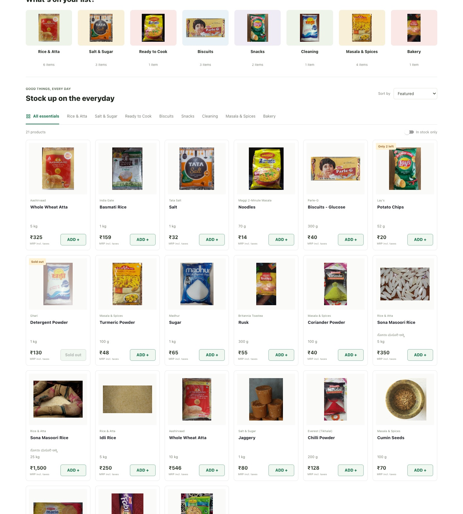
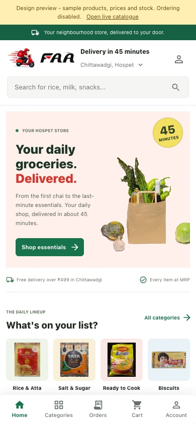
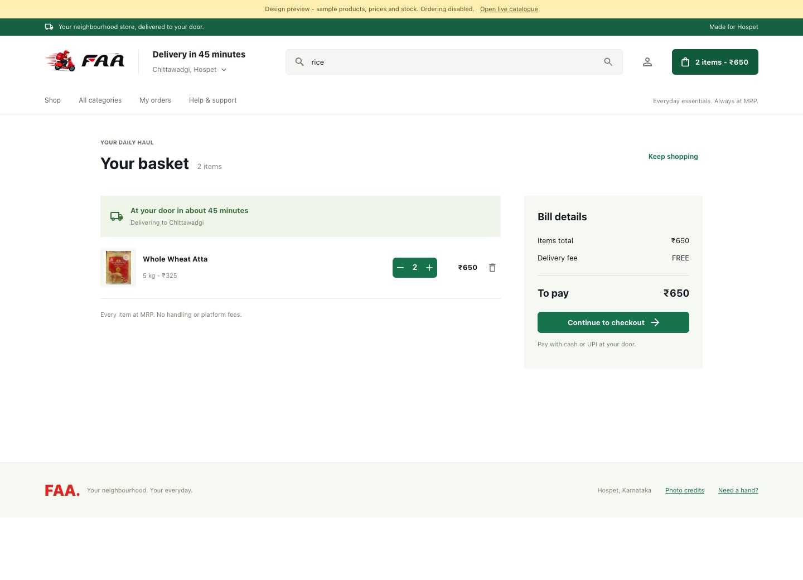

# FAA storefront redesign

The customer app now has a desktop storefront and a mobile shopping layout, with a shared delivery header, photographic categories, product sorting/stock filtering, accessible product dialogs and a responsive basket. FAA's existing identity is paired with green shopping actions, coral merchandising and yellow delivery accents.

The operations console has responsive sidebar navigation, an order search and live operational counts. Checkout/address flows and the rider screen have bounded desktop widths.

## Preview

Run `npm run dev` and open `/preview/` for the illustrative catalogue, or `/` for the actual Supabase catalogue. The preview is development-only, makes no Supabase requests, uses separate basket storage and cannot place an order. Sample prices, stock and product photographs are for design review, not a live sales catalogue.

## Verification

- Production build and strict TypeScript checking.
- ESLint with zero warnings.
- All 38 existing unit tests.
- Browser checks at 320, 390, 768, 1024, 1440 and 1920 pixels.
- Product details, modal focus/Escape, stock limits/filtering, sorting, search, basket persistence, mobile basket layout, preview checkout blocking and isolated storage/network access.
- Live public catalogue and signed-out admin/rider entry screens.
- Customer JavaScript remains within the 200 KB gzip budget.

Authenticated order placement, staff mutations and rider delivery transitions were not exercised against the live database. No database migration or deployment is part of this redesign.

See [the repository guide](../../REPOSITORY_GUIDE.md) for the module and data-flow map, and [photo credits](../../public/storefront/PHOTO_CREDITS.md) for image sources and licences.
